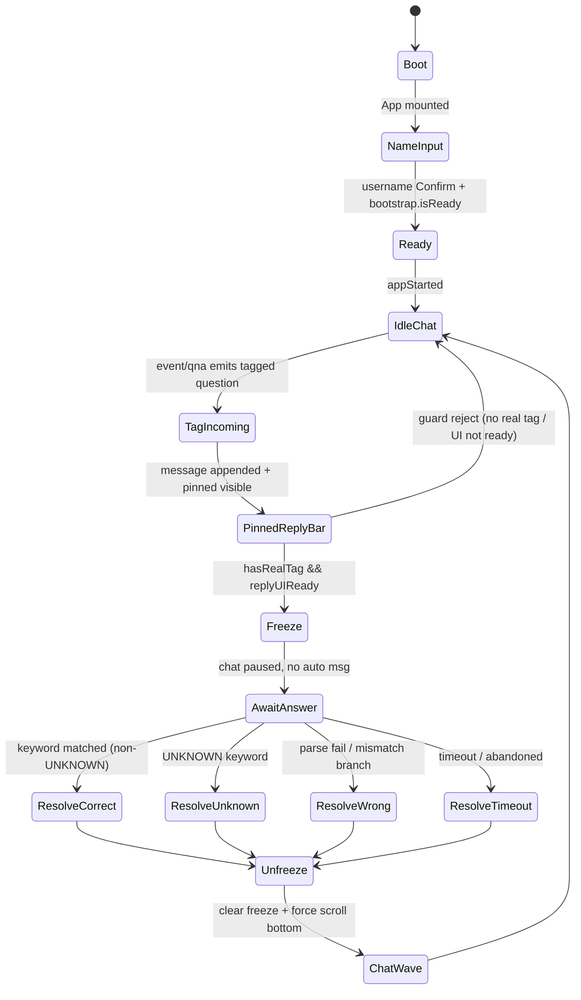

# 20｜Classic Mode Architecture（現況技術架構）

> 本文件描述的是 **目前 repo 內已存在、且實際執行中的 classic mode 架構**。本次 PR 僅新增文件，不改程式邏輯。

## 0) Repo 掃描（檔案樹 + 簡述）

### 0.1 入口（App / Bootstrap / Router）

- `src/main.tsx`
  - 應用啟動點、Boot error handling、`/debug/player` 路由分流。
- `src/app/App.tsx`
  - classic mode 主整合器（name input、chat、event、qna、video/audio orchestration、debug state）。
- `src/app/DebugPlayerPage.tsx`
  - player 最小驗證頁。

### 0.2 播放器（Video / Loop 系統）

- `src/core/player/playerCore.ts`
  - 雙 video lane（A/B）與 `switchTo` / `crossfade` / `enforceAudio`。
- `src/ui/scene/SceneView.tsx`
  - scene video 實際節點、debug force controls、video debug overlay。
- `src/config/oldhousePlayback.ts`
  - loop key alias、`MAIN_LOOP=loop3`、`loop4` 路徑與 required assets。

### 0.3 音效（SFX / Audio 管線）

- `src/audio/AudioEngine.ts`
  - fan_loop（WebAudio + fallback）生命週期。
- `src/audio/SfxRegistry.ts`
  - SFX key 與素材註冊（fan_loop / footsteps / ghost_female / low_rumble）。
- `src/audio/distanceApproach.ts`
  - 事件音效近距離 approach 與 master volume（debug 可調）。

### 0.4 聊天室（message pool / actor / tag / pinned / lock / freeze）

- `src/chat/ChatEngine.ts`
  - 自動聊天生成（event->type->persona->text）、去重、節奏視窗。
- `src/chat/ChatRules.ts`、`src/chat/ChatSelector.ts`、`src/chat/ChatTypes.ts`
  - tag 合規、persona/language/type 規則。
- `src/chat/ChatPools.ts`、`src/chat/LineRegistry.ts`
  - 文案池、reply 模板。
- `src/chat/tagFlow.ts`
  - tag 起手流程固定序：append -> scroll -> pin -> freeze。
- `src/chat/scrollController.ts`
  - chat container 註冊，force scroll 不碰 window。
- `src/ui/chat/ChatPanel.tsx`
  - chat UI、reply bar（pinned）、auto-scroll/frozen UX。
- `src/game/qna/*`
  - QNA flow/state/keyword parser，回答解析與 chain event。

### 0.5 Debug 面板（欄位來源 / 觸發器 / 測試按鈕）

- `src/app/App.tsx`
  - `window.__CHAT_DEBUG__` 寫入（chat/event/ui/system/fx）。
- `src/ui/scene/SceneView.tsx`
  - debug overlay 顯示 `window.__VIDEO_DEBUG__` 與 `window.__CHAT_DEBUG__`。
  - Event Tester（Trigger / Force Execute / Unlock）與 SFX 測試。

### 0.6 資料（SSOT / templates / words / assets）

- `src/core/events/eventRegistry.ts`（事件 SSOT）
- `src/events/eventEffectsRegistry.ts`（事件效果映射 SSOT）
- `src/game/qna/qnaFlows.ts`（QNA 流程 SSOT）
- `src/config/oldhousePlayback.ts`（loop/audio 素材 SSOT）
- `src/config/assetManifest.ts`、`src/config/assetUrls.ts`（asset / base path）
- `src/content/pools/*.json`、`src/content/thaiConsonants.json`（語料/字表）

---

## A. Overview（定位與非目標）

### 定位

classic mode 是 ThaiFeed 現行主流程：

1. 以「偽直播」形式呈現老屋氛圍。
2. 以聊天室互動 + QNA 鎖定回覆 + 事件插播形成節奏。
3. 以泰文子音練習（player answer）作為互動骨架。

### 非目標

1. 不做「靈異真偽分析系統」：目前只做體驗編排，不做真實偵測推理。
2. 不做多 mode runtime 隔離：目前所有邏輯集中於 `App.tsx`。
3. 不做 sandbox isolation：僅有 debug force hooks，尚未抽象為 mode plugin。

---

## B. Module Map（模組對照）

| 模組 | 主要檔案 | 責任 | 對外 API / 呼叫點 |
|---|---|---|---|
| Boot + Route | `src/main.tsx` | React 掛載、boot fail fallback、`/debug/player` 分流 | `computeDebugPlayerRoute()`、`BootErrorBoundary` |
| App Orchestrator | `src/app/App.tsx` | classic mode runtime 協調（bootstrap/event/chat/qna/debug） | `submit()`、`startEvent()`、`bootstrapAfterUsernameSubmit()` |
| Player Core | `src/core/player/playerCore.ts` | 雙軌切換、crossfade、active-only audio | `createPlayerCore().switchTo()` |
| Scene Runtime UI | `src/ui/scene/SceneView.tsx` | video element、debug overlay、debug force buttons | `requestVideoSwitch`、`playSfx`（props/scene event） |
| Chat Engine | `src/chat/ChatEngine.ts` | 自動訊息生成、去重、節奏視窗 | `emit()`、`tick()`、`syncFromMessages()` |
| Chat Rules | `src/chat/ChatRules.ts` | tag target 過濾、語氣/language 限制 | `canUseTag()`、`pickTagTarget()` |
| Tag Start Flow | `src/chat/tagFlow.ts` | append->scroll->pin->freeze 統一順序 | `runTagStartFlow()` |
| QNA Engine | `src/game/qna/qnaEngine.ts` | flow 狀態、問答匹配、resolve/abort | `startQnaFlow()`、`askCurrentQuestion()`、`parsePlayerReplyToOption()` |
| Event SSOT | `src/core/events/eventRegistry.ts` | 定義事件 key/cooldown/effects/qnaFlow | `EVENT_REGISTRY`、`EVENT_REGISTRY_KEYS` |
| Event Effects Mapping | `src/events/eventEffectsRegistry.ts` | eventKey -> sfx/video/blackout 映射 | `EVENT_EFFECTS` |
| Audio Engine | `src/audio/AudioEngine.ts` | fan loop 常駐與 teardown | `audioEngine.startFanLoop()`、`stopFanLoop()` |
| SFX Registry | `src/audio/SfxRegistry.ts` | 可播放音效 key 清單 | `SFX_REGISTRY` |
| Debug State | `src/app/App.tsx` + `src/ui/scene/SceneView.tsx` | debug 寫入與顯示、tester 按鈕 | `window.__CHAT_DEBUG__`、`window.__VIDEO_DEBUG__` |

---

## C. Runtime Data Flow（啟動到第一則訊息）

1. **NameInput 階段**
   - `App.tsx` 初始 `appStarted=false`，顯示 startup overlay。
   - 玩家按 Confirm，呼叫 `bootstrapAfterUsernameSubmit(normalizedName)`。

2. **Bootstrap 階段**
   - 建立/註冊 activeUser（含 handle registry），更新 `bootstrapRef.current.isReady`。
   - 初始化 chat / event debug state。

3. **Ready 階段**
   - `setAppStarted(true)` 後進入主畫面。
   - `SceneView` 開始管理 video 顯示與 debug controls。

4. **Chat 首波輸出**
   - `ChatEngine.emit/tick` 依節奏輸出觀眾訊息。
   - actor 選取會排除 `activeUser`（觀眾池隔離）。

5. **Event / QNA 觸發**
   - `startEvent(eventKey)` 通過 gate 後發題。
   - 題目若 tag 到 activeUser，走 `runTagStartFlow`：先插入訊息，再 pin，再 freeze。

6. **Video / Audio 並行**
   - Event commit 成立才觸發 effect（SFX / video / blackout）。
   - fan_loop 常駐，事件音效依 state + cooldown 判斷。

---

## D. State Machine（Classic Runtime）



### 狀態說明（對應現況）

- `Freeze` 啟動條件由 guard 控制：需同時具備「真實 mention activeUser」與「reply UI ready」。
- `AwaitAnswer` 期間禁止自動聊天湧入與事件插播（由 pause/freeze gate 擋）。
- `Resolve*` 對應 `correct / wrong / unknown / timeout` 四類結束分支。

---

## E. Chat System（Actors / 訊息種類 / 去重 / 節奏）

1. **Actor pool 分離**
   - activeUser 與 audienceUsers 分離維護。
   - 自動訊息 actor 僅可從 audience 選取，activeUser 被抽到要阻擋並記錄 debug reason。

2. **訊息種類**
   - `ChatMessageType` 由 `ChatTypes.ts` 定義（idle/buildUp/social_reply/sfx_react...）。
   - `ChatEngine` 依 event/tick 選 type，再套 persona pool 組字。

3. **去重與內容治理**
   - hash dedupe（全域 + persona window）。
   - lint 阻擋工程術語、舞台詞等 deny pattern。
   - language single-lane（zh/th 不混句）。

4. **tag 規則**
   - 只有合法 active users 可被 tag。
   - `system/you/fake_ai/mod` 等保留對象不可作為觀眾 tag target。

---

## F. Tag / Reply UX 契約（目前實作契約）

1. **tag 訊息先進聊天室，再顯示 pinned**
   - `runTagStartFlow` 固定先 `appendMessage`，再 `forceScrollToBottom`，再 `setPinnedReply`。

2. **pinned 緊貼輸入框上方**
   - reply bar 由 `ChatPanel` 渲染在 input overlay 區，不在 message list 內（debug 亦標示 `replyPinContainerLocation=input_overlay`）。

3. **freeze 只在「有人 tag @You 且 pinned 出現」時啟動**
   - App 端有 freeze guard：`hasRealTag && replyUIReady` 才會 `setChatFreeze`。

4. **freeze 期間不產生新訊息 / 不觸發異常插播**
   - 發話與事件入口都會檢查 `chatAutoPaused/chatFreeze` gate；非必要流程會被 block。

5. **玩家回覆後才恢復置底與自動滾動**
   - player send 成功且 qna `AWAITING_REPLY` 時，會 resolve + clear freeze，並切回 FOLLOW。

---

## G. Video System（loop3 主畫面與 loop/loop2/loop4 規則）

1. **主循環**
   - `MAIN_LOOP = oldhouse_room_loop3`（對外 alias `loop3`）。

2. **插播循環**
   - `loop1/loop2` 為 jump 候選；`playerCore.switchTo` 以 A/B lane crossfade。

3. **TV event 指定 loop4**
   - `EVENT_EFFECTS` 將 `TV_EVENT` 映射至 `video: loop4`。
   - debug 亦有 `Force Show loop4 (3s)`，3 秒後切回 `loop3`。

4. **回主循環**
   - 無論 event 或 debug 強制插播，流程都要回 `loop3`。

---

## H. Audio System（fan_loop 常駐 + 事件音效冷卻）

1. **fan_loop 常駐**
   - `AudioEngine` 使用 WebAudio（無法時 fallback HTMLAudio）維持連續環境音。

2. **事件音效條件**
   - `footsteps / ghost_female / low_rumble` 由事件 commit 或 debug tester 觸發。

3. **冷卻與狀態機**
   - 事件音效以 `idle/playing/cooldown` state 檢查。
   - playing timeout fallback 防止 stuck（`onended` 遺失時仍會回到 cooldown/idle）。

4. **只在事件成立時播**
   - 正常流程需通過 prepare/commit gate 才進 effects；debug force 會標記 forcedByDebug。

---

## I. Debug Panel（欄位 + 來源 + 典型排查流程）

### 主要欄位群組

1. **System / Bootstrap**
   - `system.bootstrap.isReady/activatedAt/by`
   - `chat.activeUser.*`（handle、registry、displayName）

2. **Chat / Freeze / Scroll / Pin**
   - `chat.autoScrollMode`
   - `chat.freeze.*`
   - `chat.scroll.containerFound/lastForceReason/lastForceResult/metrics`
   - `ui.replyBarVisible`、`ui.pinned.visible/textPreview`

3. **Event / QNA**
   - `event.lastEvent.*`
   - `event.lastCommitBlockedReason`
   - `event.blocking.*`（lockTarget、lockElapsed）
   - `event.qna.*`（status、questionMessageId、taggedUser）

4. **Audio**
   - `audio.contextState`
   - `event.stateMachine[eventKey].state/cooldownRemaining/lastResult/reason`

5. **Video**
   - `video.currentKey`、`video.lastSwitch`、`plannedJump`、`whyNotJumped`

### 典型排查流程

1. 先看 `system.bootstrap.isReady` 與 `chat.activeUser.registryHandleExists`。
2. 檢查 `event.lastStartAttemptBlockedReason` / `event.lastCommitBlockedReason`。
3. 若 tag 問題：看 `mention.lastParsedMentions` + `ui.replyBarVisible` + `event.freezeGuard`。
4. 若 loop4 問題：看 `event.lastEffects.videoSwitchedTo` 與 `video.lastDenied.denyReason`。
5. 若音效問題：看 event audio state（idle/playing/cooldown）與 `audio.contextState`。

---

## J. Extension Points（未來 sandbox 的可插拔插槽）

> 本節為介面草案（文件設計），本次不實作。

### 建議抽象 1：Mode Runtime

```ts
interface ModeRuntime {
  id: 'classic' | string;
  bootstrap(input: { activeUserHandle: string }): Promise<void>;
  tick(now: number): void;
  handlePlayerInput(text: string): Promise<{ ok: boolean; reason?: string }>;
  getDebugSnapshot(): Record<string, unknown>;
}
```

### 建議抽象 2：Event Pipeline

```ts
interface EventPipeline {
  prepare(eventKey: StoryEventKey): Promise<{ ok: boolean; blockedReason?: string }>;
  commit(eventKey: StoryEventKey): Promise<{ ok: boolean; blockedReason?: string }>;
  effects(eventKey: StoryEventKey): Promise<void>;
}
```

### 建議抽象 3：Chat Freeze Contract

```ts
interface FreezeContract {
  requestFreeze(reason: 'tag_wait_reply'): void;
  clearFreeze(reason: string): void;
  canEmitAutoMessage(): boolean;
}
```

此三層可讓 future sandbox mode 只替換 mode/pipeline，而不重寫整個 App shell。

---

## K. Known Issues / FAQ（記錄現況，不在本 PR 修 code）

1. **「tag 必須先發言才生效」舊印象**
   - 現況已透過 bootstrap handle registry 修正，但若 username 未完成 bootstrap 仍會失效。

2. **pinned 沒貼齊輸入框**
   - 現況契約是 input overlay；若樣式被覆蓋會誤看成在 chat list 內。

3. **loop4 不播 / 播了不回 loop3**
   - 通常是 event commit gate 或 video switch deny；可用 debug force loop4 3s 檢查最小路徑。

4. **玩家被自動發言（不應發生）**
   - actor pool 應隔離 activeUser；若再次發生需先看 `actorPickBlockedReason` 與 audience pool 組成。

5. **freeze 期間仍出現新訊息**
   - 應先檢查訊息來源是否 debug 注入或 bypass gate。

---

## L. Appendix（最小重構建議，非必改）

### 現況

- classic mode 主要邏輯高度集中在 `src/app/App.tsx`。
- `src/director/EventEngine.ts` / `EventRegistry.ts` 目前為空殼，未形成真實中介層。

### 最小重構建議（分階段）

1. 新增 `src/modes/classic/`（僅搬移，不改行為）
   - `classicRuntime.ts`（從 App 抽 orchestration）
   - `classicDebugAdapter.ts`（統一 debug snapshot）
   - `classicContracts.ts`（mode 介面）

2. 保留 UI Shell
   - `App.tsx` 保留 layout + name input + panel 組件。
   - 將業務 callback 改呼叫 `classicRuntime`。

3. 預留 sandbox mode
   - 新增 `src/modes/sandbox/`，可用同一套 `ModeRuntime` 介面接入。

4. 最後再處理 director
   - 將空殼 `src/director/*` 改為 adapter 或刪除（需先完成 3 次 PR 規則與文件同步）。

